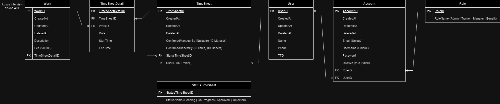

## ERD



## How to run this project
- clone this project
```bash
git clone https://git.enigmacamp.com/enigma-camp/upskilling-class/01040726-upskilling-angular/final-task/be-timesheet-app/golang-timesheet.git
```
- copy the .example.env and make new file .env
```bash
cp .example.env .env 
```
- setting the env file
- optional (for new update please checkout dev/alvindo)
```bash
git checkout dev/alvindo
```
- run with
```bash
go run . 
```

## For documentation
[go-timesheet.postman_collection.json](go-timesheet.postman_collection.json)

## How to use import documentation
- open postman
- click import
- select the file above

## Endpoint that already tested

### Auth
- [x] **login** [POST] `localhost:8080/api/v1/login`
- [x] **register** [POST] `localhost:8080/api/v1/admin/register`

### Works
- [x] **create works** [POST] `localhost:8080/api/v1/admin/works`
- [x] **get works by id** [GET] `localhost:8080/api/v1/admin/works/:id`
- [x] **get all works** [GET] `localhost:8080/api/v1/admin/works?paging=&rowsPerPage=`

### Accounts
- [x] **change password** [PUT] `localhost:8080/api/v1/accounts/change-password`
- [x] **get detail profile** [GET] `localhost:8080/api/v1/accounts/profile`

### TimeSheets
- [x] **create timesheet** [POST] `localhost:8080/api/v1/timesheets`
- [x] **get all timesheet** [GET] `localhost:8080/api/v1/timesheets`
- [x] **update timesheet** [PUT] `localhost:8080/api/v1/timesheets/:id`
- [x] **get timesheet by id** [GET] `localhost:8080/api/v1/timesheets/:id`