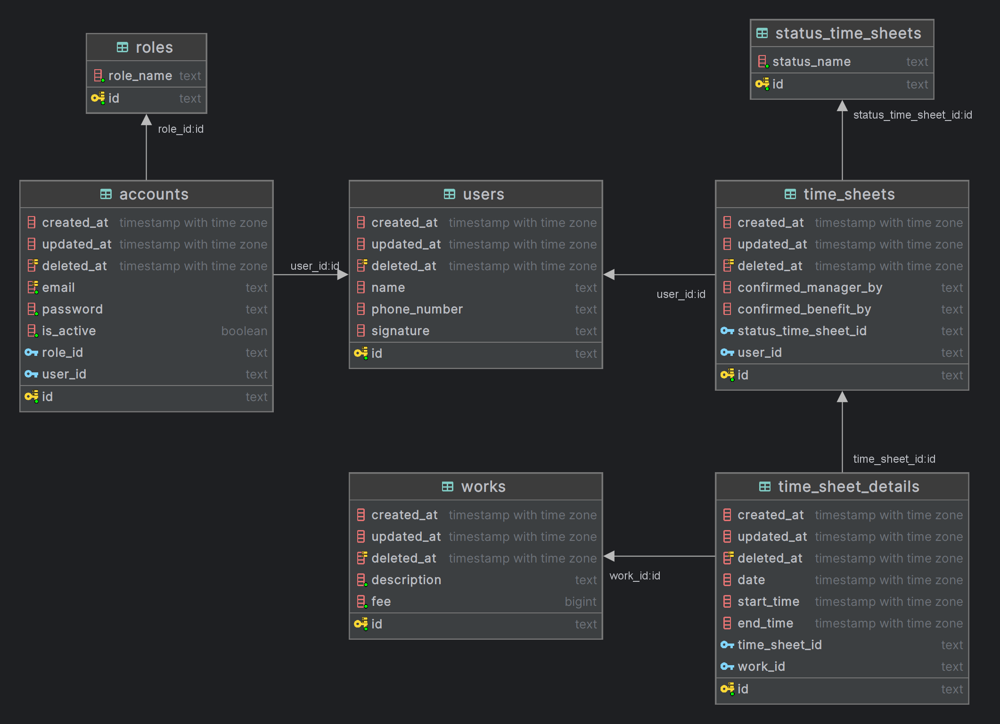

## ERD



## How to run this project
- clone this project
```bash
git clone https://git.enigmacamp.com/enigma-camp/upskilling-class/01040726-upskilling-angular/final-task/be-timesheet-app/golang-timesheet.git
```
- run with
```bash
go run . 
```

## For documentation
[go-timesheet.postman_collection.json](go-timesheet.postman_collection.json)